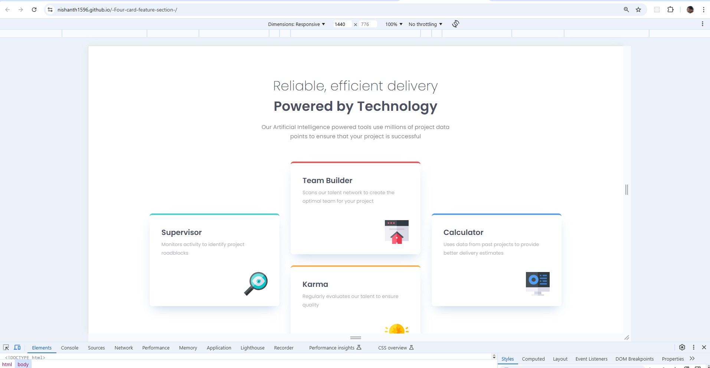
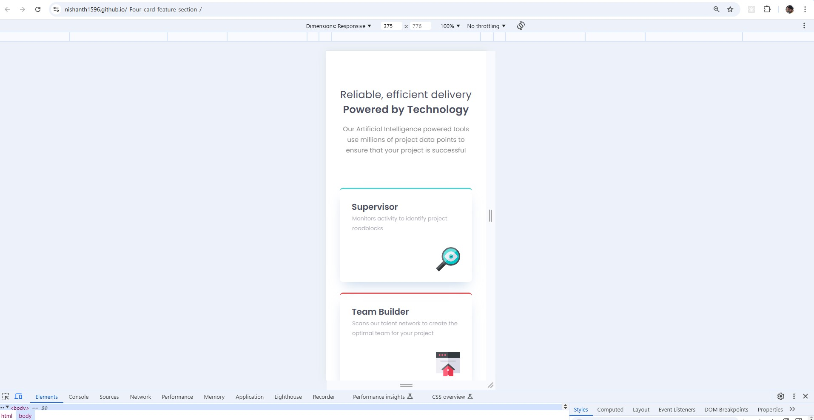
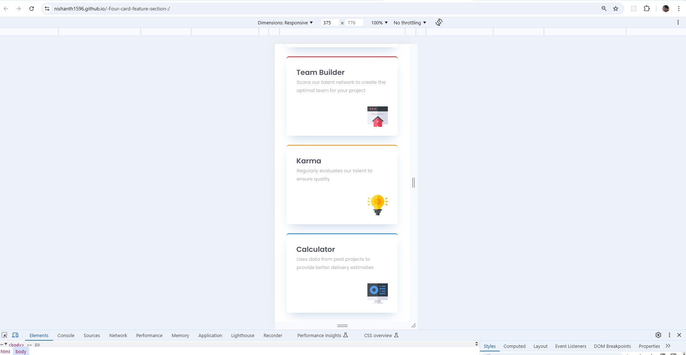

# Frontend Mentor - Four card feature section solution

This is a solution to the [Four card feature section challenge on Frontend Mentor](https://www.frontendmentor.io/challenges/four-card-feature-section-weK1eFYK). Frontend Mentor challenges help you improve your coding skills by building realistic projects.

## Table of contents

- [Overview](#overview)
  - [The challenge](#the-challenge)
  - [Screenshot](#screenshot)
  - [Links](#links)
- [My process](#my-process)
  - [Built with](#built-with)
  - [What I learned](#what-i-learned)
  - [Continued development](#continued-development)
  - [Useful resources](#useful-resources)
- [Author](#author)
- [Acknowledgments](#acknowledgments)

## Overview

### The challenge

Users should be able to:

- View the optimal layout for the site depending on their device's screen size

### Screenshot

### Links

- Solution URL: [solution](https://github.com/nishanth1596/-Four-card-feature-section-)
- Live Site URL: [live site ](https://nishanth1596.github.io/-Four-card-feature-section-/)

## My process

### Built with

- Semantic HTML5 markup
- CSS custom properties
- Flexbox
- CSS Grid
- Desktop-first workflow

### What I learned

I've learned a lot about CSS Grid layout. With every solution, I am able to look at the design more carefully and identify many details I missed in my previous solutions for different challenges. In this solution, I learned how to apply opacity, how to select different layers in Figma to get accurate design details, and how to add box shadows in CSS.

### Continued development

For this project, I worked on responsiveness for desktop (1440px) and mobile (375px) only. In the future, I will ensure that this and upcoming challenges are fully responsive across all devices.

### Useful resources

MDN Web Docs - Flexbox - This documentation helped me understand Flexbox better.
Google Fonts - I used the Outfit font from Google Fonts to style the text.

### Author

- Name: Nishanth
- Website - [My GitHub Profile](https://github.com/nishanth1596)
- Frontend Mentor - [@nishanth1596](https://www.frontendmentor.io/profile/nishanth1596)
- Twitter - [@nishanth1596](https://x.com/nishanth1596)

### Acknowledgments

A special thanks to the Frontend Mentor community for providing inspiration and feedback on this project. The resources provided by the platform were very helpful in getting me to the solution.
